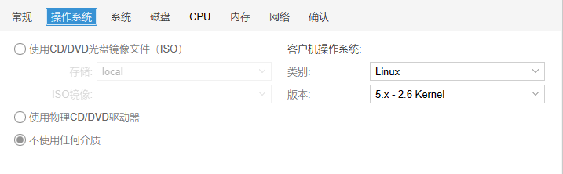
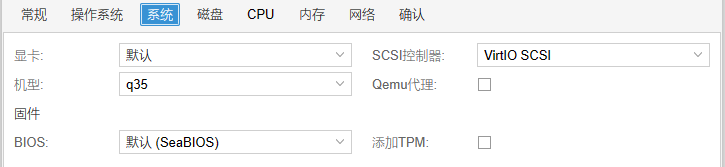
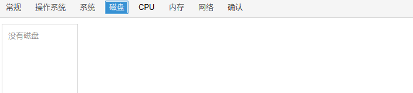

# PVE安装黑群晖
## 准备镜像
[下载地址](https://github.com/wjz304/rr)    
下载后上传.img文件至PVE
## 创建虚拟机
  
  

内存最小4G，其他设置默认即可

创建完成后，去PVE的shell中添加启动硬盘

`qm importdisk <vm_id> <iso_path> local-lvm`    
添加完成后， 去web管理页面，将添加的硬盘类型改为SATA，并设置为虚拟机的第一启动项

然后添加存储硬盘，可以添加直通硬盘或虚拟硬盘，没有硬盘群晖系统无法启动

## 启动虚拟机
启动后，打开shell中提供的地址  
`选择型号` > `选择版本` > `编译引导` > `启动`  
根据shell提供的管理地址即可进入群晖的管理页面