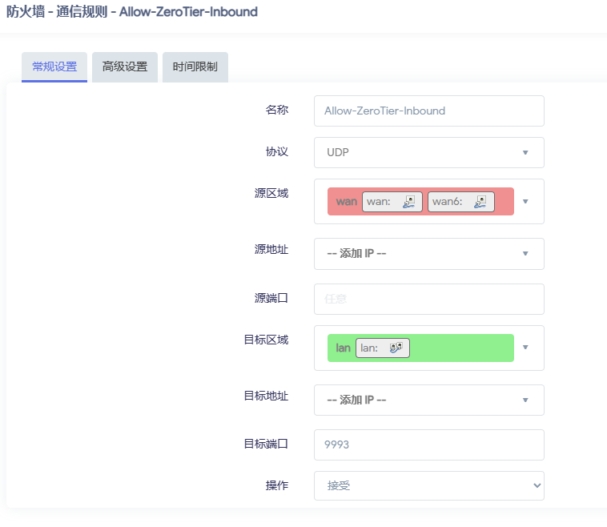
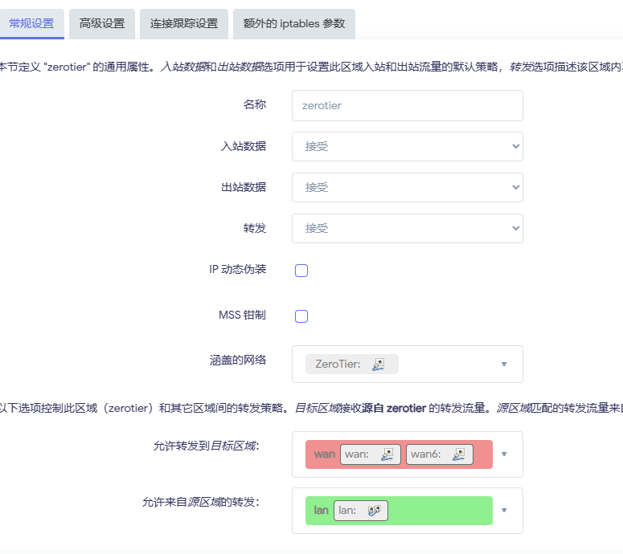

# Openwrt使用Tips

## OpenWrt镜像扩容

```bash
#解压
gzip -kd openwrt-spp-winter\[2022\]-x86-64-generic-squashfs-legacy.img.gz
#改名
mv openwrt-spp-winter\[2022\]-x86-64-generic-squashfs-legacy.img.gz op.img
#扩容500M
dd if=/dev/zero bs=1M count=500 >> op.img
parted op.img
print
resizepart 2 100%
quit
```

## Pve中使用LXC安装OpenWrt

1. 镜像准备  
    准备`generic-rootfs.tar.gz`格式的镜像，上传至Pve CT模板
2. 创建LXC容器  
    Web端不支持创建，必须使用shell
    ```bash
    pct create <id> local:vztmpl/<image_name> --rootfs local-lvm:<hard_drive_of_G> --ostype unmanaged --hostname <name> --arch amd64 --cores 4 --memory 256 --swap 0 -net0 bridge=vmbr0,name=eth0
    ```

    创建完成后，修改lxc配置文件，路径为`/etc/pve/lxc/<id>.conf`

    * 添加网卡直通
    ```
    # openwrt.common.conf是PVE自带的openwrt配置文件示例，内含一些基本设置
    lxc.include: /usr/share/lxc/config/openwrt.common.conf

    # link为pve系统中的设备名，name为lxc中对应的设备名
    # eth0 会被openwrt分配为lan口
    lxc.net.0.type: phys
    lxc.net.0.link: enp3s0
    lxc.net.0.name: eth0
    lxc.net.0.flags: up
    # wan口
    lxc.net.1.type: phys
    lxc.net.1.link: enp1s0
    lxc.net.1.name: eth1
    lxc.net.1.flags: up

    # 允许cgroup权限
    lxc.cgroup.devices.allow: a
    lxc.cgroup2.devices.allow: a

    # pppoe相关
    lxc.mount.entry: /dev/ppp dev/ppp none bind,create=file
    lxc.mount.entry: /dev/net/tun dev/net/tun none bind,create=file

    # clash
    lxc.apparmor.profile: unconfined
    lxc.apparmor.allow_nesting: 1
    ```
3. 注释掉`/usr/share/lxc/config/openwrt.common.conf`中功能的drop，clash会用到这些功能

    ```
    # lxc.cap.drop = sys_ptrace
    # lxc.cap.drop = sys_resource
    ```

4. 启动LXC容器
5. 禁用procd jail  
打开LXC容器的终端，编辑文件`/etc/init.d/dnsmasq`，找到procd_add_jail dnsmasq ubus log这一行并把这一段都注释掉：
    ```
    local instance_ifc instance_netdev                
            config_get instance_ifc "$cfg" interface                       
            [ -n "$instance_ifc" ] && network_get_device instance_netdev "$instance_ifc" &&
                    [ -n "$instance_netdev" ] && procd_set_param netdev $instance_netdev

            # procd_add_jail dnsmasq ubus log
            # procd_add_jail_mount $CONFIGFILE $DHCPBOGUSHOSTNAMEFILE $DHCPSCRIPT $DHCPSCRIPT_DEPENDS
            # procd_add_jail_mount $EXTRA_MOUNT $RFC6761FILE $TRUSTANCHORSFILE
            # procd_add_jail_mount $dnsmasqconffile $dnsmasqconfdir $resolvdir $user_dhcpscript
            # procd_add_jail_mount /etc/passwd /etc/group /etc/TZ /etc/hosts /etc/ethers
            # procd_add_jail_mount_rw /var/run/dnsmasq/ $leasefile                                             
            # case "$logfacility" in */*)                                                          
            #        [ ! -e "$logfacility" ] && touch "$logfacility"                                 
            #        procd_add_jail_mount_rw "$logfacility"                                           
            # esac                                                                                 

            procd_close_instance
    ```
执行`/etc/init.d/dnsmasq restart`

## 使用PVE将img格式的openwrt镜像转化为CT模板镜像

1. 准备好img镜像，上传至PVE的local镜像
2. 按顺序执行命令
```bash
# 创建映射路径
mkdir /mnt/openwrt

# 加载NBD模块
modprobe nbd

# 挂载指定格式和镜像
qemu-nbd -c /dev/nbd0 -f raw /var/lib/vz/template/iso/immortalwrt-x86-64-generic-squashfs-combined.img

# 查看所挂载分区
lsblk -f /dev/nbd0

# 将squashfs所在路径映射至之前创建的路径
mount /dev/nbd0p2 /mnt/openwrt

# 在映射路径下重新压缩，将其保存在CT模板路径
cd /mnt/openwrt/ && ls
tar -czvf /var/lib/vz/template/cache/openwrt-lxc.rootfs.tar.gz *

# 清理
cd ~
umount /mnt/openwrt/
qemu-nbd -d /dev/nbd0

```

## Openwrt自用软件包
* luci-i18n-argon-config-zh-cn
* luci-i18n-adblock-zh-cn
* luci-app-openclash
* luci-i18n-ttyd-zh-cn
* luci-i18n-frpc-zh-cn
* luci-i18n-netdata-zh-cn
* luci-i18n-zerotier-zh-cn

## Openwrt uci 命令参考

* 显示所有网络设置
    > `uci show network`
* 设置lan口ip
    > `uci set network.lan.ip=xxx`
* 提交更改
    > `uci commit network`

## OpenWrt设置Zerotier
1.  添加防火墙规则
    网络 > 防火墙 > 通信规则    
    添加规则如图    
      
    注意源区域可以选择`任意区域`， 目标区域可以选择`设备`
2. 添加接口
    网络 > 接口 > 添加新接口
    接口配置如下
3. 添加防火墙
    网络 > 防火墙 > 常规设置  
    添加防火墙设置如下  
    